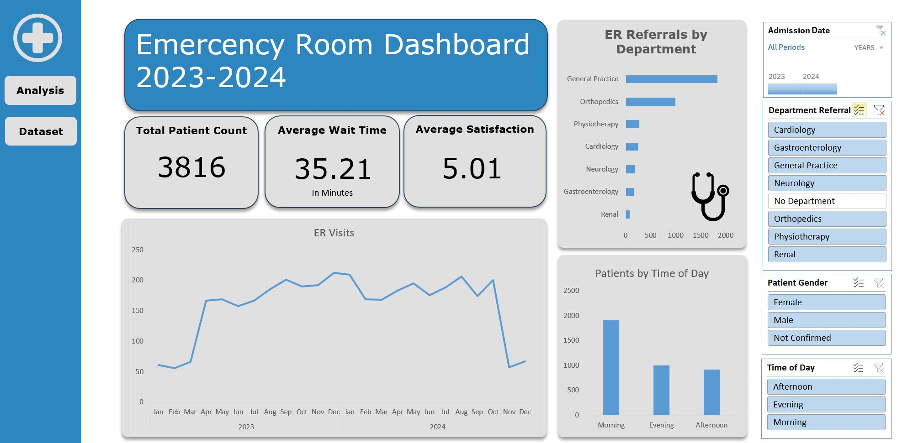

# Emergency Room Analysis

## Table of contents

- [Project Overview](#project-overview)
- [Data Sources](#data-sources)
- [Data Analysis](#data-analysis)
- [Findings](#findings)
- [Recommendations](#recommendations)

### Project Overview

This data analysis project examines emergency room visit data from 2023-2024 using Microsoft Excel. The primary goal was to uncover trends in patient volume, average wait times, satisfaction scores, and department referrals. I used pivot tables, slicers, timelines, and calculated fields to build an interactive dashboard for stakeholders to quickly explore patterns and performance indicators.

To simulate a real world healthcare reporting scenario, I took on the role of a data analyst. My objective was to communicate key insights using clear and effective visuals. This project was completed independently without relying on video tutorials, highlighting my ability to manage and execute an analysis project end-to-end using Excel alone.



### Data Sources
Hospital ER_Data.csv: The main dataset used in this project is the "Hospital ER_Data.csv" file, which includes detailed records of the patients that visited the Emercency room.

### Tools

Microsoft Excel – Used for data cleaning, column formatting, and exploratory analysis. Excel features such as pivot tables, slicers, timelines, conditional formatting, and charts were used to build an interactive dashboard and track KPIs.

Here’s a cleaned-up version of your **Data Cleaning / Preparation** section based on what you actually did:

---

### Data Cleaning / Preparation

During the data preparation phase, I used Excel to clean and standardize the dataset for analysis:

1. Converted Time Format
   Admission times were reformatted to a 12-hour US format with AM/PM for consistency and readability.

2. Split Admission Date & Time
   The datetime column was separated into two new columns: `Admission Date` and `Admission Time`. This allowed for more granular analysis by time of day and date.

3. Filled in Missing Satisfaction Scores
   Patient satisfaction had missing values. I used Excel’s Data Analysis Toolpak to analyze the distribution and decided to fill blanks using the median, which was 5, supported by the mean and mode. This decision is noted in the final documentation as a caution for interpretation.

4. Standardized Gender Labels
   I replaced shorthand values for clarity:

   * `M` → `Male`
   * `F` → `Female`
   * `NC` → `Not Confirmed`

5. Created Time of Day Categories
   To better understand visit trends, I created a new `Time of Day` column using the following logic:

   ```excel
   =IF([@[Time in Number]]<0.5,"Morning",IF([@[Time in Number]]<0.75,"Afternoon","Evening"))
   ```

These steps ensured the dataset was clean, formatted, and ready for visualization and insight generation.

### Exploratory Data Analysis

EDA focused on identifying trends and key metrics that would support healthcare operations and decision-making. The following KPIs were explored using Excel:

- KPI Requirements
- Total Patient Count
- Average Wait Time
- Average Satisfaction Score
- ER Visits by Month
- Patient Volume by Department
- Visit Distribution by Time of Day (Morning, Afternoon, Evening)
- Gender Breakdown of Patients
- Admission Reason Breakdown (Injury, Illness, Other)
- These KPIs were selected to help hospital staff monitor patient flow, satisfaction, and departmental performance over time.

### Data Analysis
Yes — I can absolutely help with that. Based on the images and conversations we've had, I’ll translate your SQL-style documentation into **Excel-based equivalents** that mirror what you did, using clear, stakeholder-friendly descriptions.

Here’s a polished version of your **Data Analysis & KPI Calculation** section for this ER project using Excel:

### KPI Calculations (Excel-Based)

I evaluated emergency room performance with the following KPIs in mind.

- Total Patient Count: Total number of patients admitted to the ER.
- Average Wait Time: Mean time between admission and treatment.
- Average Satisfaction Score: Average patient-reported satisfaction on a scale of 0–10.
- Referrals by Department: Number of patients sent to departments like General Practice or Cardiology.
- All KPIs were visualized using Pivot Tables, filters, and slicers for dynamic, interactive analysis.


### Findings
At first glance, the data seemed straightforward, but visualizing it in Excel revealed several meaningful patterns.
1. Patient volume steadily increased through mid-2024 before dropping in the final two months, suggesting a possible seasonal trend or that data collection was still ongoing.
2. Wait times rose during months with more patients, possibly due to staffing constraints or seasonal spikes. For example, illnesses like the flu or common cold may have played a role.
3. Satisfaction scores remained fairly consistent, averaging around 5 out of 10, but dipped slightly during high-volume months.
4. General Practice received significantly more ER referrals than other departments, indicating potential strain or high demand in that area.
5. Most ER admissions occurred during the morning shift, revealing a time-of-day pattern that could inform scheduling and resource allocation.
6. Some records contained missing department or satisfaction score data, highlighting opportunities to improve data entry practices or system tracking.

### Recommendations
I recommend the following from the insights I gained from this analysis:
- Increase staffing in General Practice, which consistently receives the highest number of ER referrals. Additional resources may help reduce bottlenecks and improve patient flow.
- Reallocate staff to cover peak morning hours, as most ER visits occur during that time. Optimizing shift coverage can improve patient experience and reduce wait times.
- Revise the patient satisfaction survey process to better understand the drivers of low satisfaction scores. Consider follow up surveys or targeted questions to uncover specific pin points.
- Improve referral data collection practices. Over 5,000 records showed no referral destination, which may indicate either incomplete documentation or on site issue resolution. Adding a “Treated on Site” option could clarify this category and improve data accuracy.

### References
1. Data
   - [Files](https://drive.google.com/drive/folders/1mg8zaCAVh-yzbEcX710vZ5NvzlF-xV6b)


